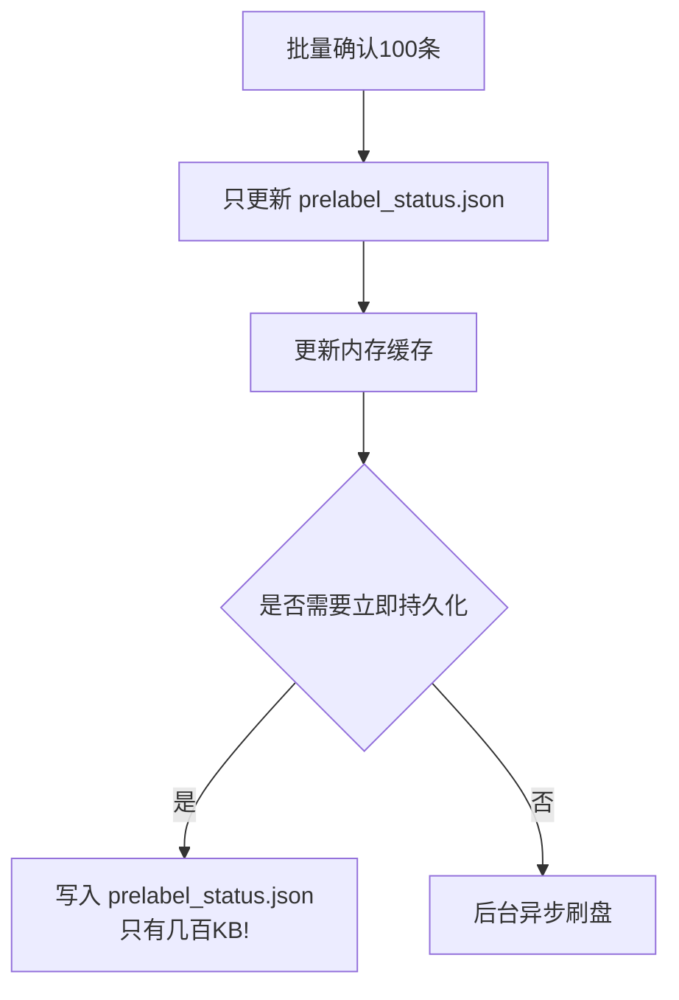

# 统一标注数据架构设计方案

## 1. 需求概述

### 1.1 核心目标
建立数据集隔离的统一标注系统，支持：
- 多数据源（OCR预标注、聚类标注、手动标注）协同
- 完整的变更历史记录
- 双向数据同步
- 防止数据冲突和不一致

### 1.2 关键约束
- ✅ **必须做到数据集级别的隔离**
- ✅ **防止一张图片对应多个汉字**
- ✅ **只更新最新一轮聚类数据**
- ✅ **支持纯文件系统（无数据库依赖）**

---

## 2. 数据结构设计

### 2.1 目录结构
```
bussiness/datahome/{dataset_id}/
├── pre_labels.json              # OCR预标注数据
├── unified_labels.json          # 统一标注主数据
├── label_history.json           # 标注变更历史
├── index/
│   ├── char_to_images.json      # 汉字→图片索引
│   └── image_to_char.json       # 图片→汉字索引
└── clusters/
    ├── {version}_hog_clusters.json  # 各轮次聚类数据
    └── {version}_cluster_labels.json # 各轮次聚类标注
```

---

### 2.2 数据结构定义

#### 2.2.1 统一标注数据 (`unified_labels.json`)
```json
{
  "dataset": "pdf5826",
  "total_labeled": 268,
  "char_distribution": {
    "国": 268,
    "面": 30
  },
  "annotations": [
    {
      "char_id": "page_3_line_12_char_3",
      "char": "国",
      "image_path": "datahome/pdf5826/pdf_chars/page_3_line_12_char_3.png",
      "dataset": "pdf5826",
      "status": "labeled",
      "source": "ocr_confirm",  // 数据来源: ocr_confirm / cluster / manual
      "created_at": "2026-05-13T18:30:00",
      "updated_at": "2026-05-13T18:30:00"
    }
  ]
}
```

**字段说明：**
| 字段 | 类型 | 必填 | 说明 |
|------|------|------|------|
| `char_id` | string | ✅ | 唯一标识符，格式：page_N_line_M_char_K |
| `char` | string | ✅ | 标注的汉字 |
| `image_path` | string | ✅ | 图片相对路径 |
| `dataset` | string | ✅ | 所属数据集 |
| `status` | string | ✅ | `labeled` / `pending` / `skipped` |
| `source` | string | ✅ | `ocr_confirm` / `cluster` / `manual` |
| `created_at` | string | ✅ | 创建时间 ISO8601 |
| `updated_at` | string | ✅ | 更新时间 ISO8601 |

**约束：**
- `image_path` 唯一（防止一张图多标签）
- `char_id` 唯一

---

#### 2.2.2 标注变更历史 (`label_history.json`)
```json
{
  "dataset": "pdf5826",
  "history": [
    {
      "id": "hist_001",
      "char_id": "page_3_line_12_char_3",
      "old_char": null,
      "new_char": "国",
      "changed_by": "user",  // user / ocr_model / clustering
      "change_source": "ocr_confirm",
      "timestamp": "2026-05-13T18:30:00",
      "ip": "127.0.0.1",
      "comment": "OCR预标注确认"
    },
    {
      "id": "hist_002",
      "char_id": "page_3_line_12_char_3",
      "old_char": "国",
      "new_char": "國",
      "changed_by": "user",
      "change_source": "manual_edit",
      "timestamp": "2026-05-13T19:00:00",
      "ip": "127.0.0.1",
      "comment": "修正为繁体"
    }
  ]
}
```

---

#### 2.2.3 索引数据 (`index/`)

**`char_to_images.json`** - 汉字→多图片映射
```json
{
  "国": ["page_3_line_12_char_3", "page_8_line_18_char_12", ...],
  "面": ["page_10_line_14_char_6", ...]
}
```

**`image_to_char.json`** - 图片→汉字映射（快速查找）
```json
{
  "page_3_line_12_char_3": "国",
  "page_8_line_18_char_12": "国",
  "page_10_line_14_char_6": "面"
}
```

---

#### 2.2.4 OCR预标注数据 (`pre_labels.json`)
```json
{
  "version": "1.0",
  "dataset": "pdf5826",
  "generated_at": "2026-05-13T18:00:00",
  "stats": {
    "total": 11609,
    "high_confidence": 10419,
    "low_confidence": 741
  },
  "char_counts": {
    "国": { "total": 268, "high": 245, "medium": 20, "low": 3 },
    "面": { "total": 30, "high": 27, "medium": 1, "low": 2 }
  },
  "prelabels": [
    {
      "char_id": "page_10_line_14_char_6",
      "predicted_char": "国",
      "confidence": 0.9987,
      "confidence_level": "high",
      "status": "pending",  // pending / confirmed
      "image_path": "datahome/pdf5826/pdf_chars/page_10_line_14_char_6.png",
      "lineage": {
        "line_name": "page_10_line_14",
        "char_idx": 6,
        "page": 10,
        "line": 14,
        "col_start": 703,
        "col_end": 738,
        "width": 35
      }
    }
  ]
}
```

---

#### 2.2.5 聚类数据 (`clusters/`)

**多轮次设计：**
```
clusters/
├── v1_hog_clusters.json
├── v1_cluster_labels.json
├── v2_hog_clusters.json
└── v2_cluster_labels.json  # ← 最新轮次
```

**聚类数据 (`{version}_hog_clusters.json`)：**
```json
{
  "version": "v2",
  "created_at": "2026-05-13T17:00:00",
  "is_latest": true,
  "clusters": {
    "cluster_001": [
      { "char_id": "page_3_line_12_char_3", "char": "国", "confirmed": true }
    ]
  }
}
```

---

## 3. 核心业务逻辑

### 3.1 数据唯一性约束

#### 约束1：防止一张图片对应多个汉字
```python
# 每次更新前检查
def validate_update(char_id: str, new_char: str) -> bool:
    # 检查 image_to_char 索引
    current_char = image_to_char.get(char_id)
    
    if current_char and current_char != new_char:
        raise ConflictError(
            f"图片 {char_id} 已有标签 '{current_char}', 不能改为 '{new_char}'"
        )
    
    return True
```

#### 约束2：数据集隔离
```python
# DataStore 初始化时强制指定
data_store = DataStore(dataset_id="pdf5826")
data_store.prelabels_path = f"bussiness/datahome/pdf5826/pre_labels.json"
```

---

### 3.2 双向数据同步流程

#### 流程A：OCR标注确认 → 统一数据 → 更新聚类
```
用户点击确认 (前端)
    ↓
confirm_ocr_label(char_id, char)
    ↓
[事务1] 更新统一标注
    - 写 unified_labels.json
    - 写 label_history.json
    - 更新索引
    ↓
[事务2] 同步到聚类（只更新最新轮次）
    - 找到最新聚类版本
    - 更新对应 cluster 的字符
    - 刷新聚类统计
```

#### 流程B：聚类标注 → 统一数据 → 更新OCR状态
```
用户标注聚类 (前端)
    ↓
confirm_cluster_label(cluster_id, char_id, char)
    ↓
[事务1] 更新聚类标注
    - 更新最新聚类的 labels
    ↓
[事务2] 同步到统一标注
    - 写 unified_labels.json
    - 写 label_history.json
    - 更新索引
    ↓
[事务3] 同步到OCR预标注
    - 更新 pre_labels.json 的 status 为 'confirmed'
```

---

### 3.3 原子操作与事务机制

#### 纯文件事务机制
```python
class AtomicDataStore:
    def update_annotation_with_transaction(self, char_id: str, char: str, source: str):
        # 1. 写入WAL日志 (用于恢复)
        self.write_wal("update", {
            "char_id": char_id, 
            "old_char": get_current(char_id),
            "new_char": char,
            "source": source
        })
        
        # 2. 写临时文件
        self.write_tmp("unified_labels", new_data)
        self.write_tmp("image_to_char", new_index)
        
        # 3. 原子重命名 (一次性提交所有变更)
        self.atomic_commit([
            ("unified_labels.tmp", "unified_labels.json"),
            ("image_to_char.tmp", "image_to_char.json")
        ])
        
        # 4. 清理WAL
        self.cleanup_wal()
```

---

## 4. API接口设计

### 4.1 统一标注相关

| 接口 | 方法 | 说明 |
|------|------|------|
| `/api/labeling/stats` | GET | 获取全局统计 |
| `/api/labeling/annotations/{char_id}` | GET | 获取单个标注详情 |
| `/api/labeling/annotations` | GET | 批量获取标注（分页） |
| `/api/labeling/annotations` | POST | 创建标注 |
| `/api/labeling/annotations/{char_id}` | PUT | 更新标注 |
| `/api/labeling/annotations/{char_id}` | DELETE | 删除标注 |
| `/api/labeling/annotations/{char_id}/history` | GET | 获取历史记录 |

---

### 4.2 OCR预标注相关

| 接口 | 方法 | 说明 |
|------|------|------|
| `/api/labeling/prelabels/{char}` | GET | 获取汉字的预标注列表 |
| `/api/labeling/prelabels/confirm` | POST | 确认单个预标注 |
| `/api/labeling/prelabels/confirm/batch` | POST | 批量确认预标注 |
| `/api/labeling/prelabels/{char_id}/edit` | POST | 修正OCR预测汉字 |

---

### 4.3 聚类标注相关

| 接口 | 方法 | 说明 |
|------|------|------|
| `/api/mc/rounds` | GET | 获取轮次列表（最新优先） |
| `/api/mc/rounds/{round_id}/clusters` | GET | 获取轮次聚类列表 |
| `/api/mc/rounds/{round_id}/clusters/{cluster_id}/confirm` | POST | 确认聚类标注 |

---

## 5. 数据一致性保证

### 5.1 更新策略

| 场景 | 更新方向 | 优先级 |
|------|---------|--------|
| OCR确认 → 统一数据 → 聚类 | 单向 | OCR > 聚类 |
| 聚类标注 → 统一数据 → OCR | 单向 | 聚类 > OCR |
| 手动编辑 → 统一数据 → 全部同步 | 双向 | 手动 > 所有 |

### 5.2 幂等性设计

每个接口都要做到**重复调用也安全**：

```python
def update_annotation_idempotent(char_id: str, new_char: str, source: str):
    # 1. 如果已经是这个值，直接返回
    if get_char(char_id) == new_char:
        return {"success": True, "idempotent": True}
    
    # 2. 否则执行更新
    # ...
```

---

## 6. 统计计算

### 6.1 统一标注统计
- 总标注数
- 按汉字分布
- 按来源分布（OCR/聚类/手动）

### 6.2 OCR预标注统计
- 总预标注数
- 各汉字的待确认/已确认数
- 置信度分布

### 6.3 聚类统计
- 聚类总数
- 已标注聚类数
- 各汉字在聚类中的分布

---

## 7. 迁移方案（从现有代码迁移）

### 阶段1：补充现有数据的缺失字段
1. 为现有 `unified_labels.json` 记录补充 `dataset`、`image_path`、`source`
2. 初始化索引文件

### 阶段2：实现原子操作层
1. 添加 `AtomicDataStore` 类
2. 添加 WAL 机制

### 阶段3：实现双向同步
1. OCR → 统一 → 聚类
2. 聚类 → 统一 → OCR

### 阶段4：添加历史记录
1. 实现 `LabelHistory` 类
2. 开始记录变更

---

## 8. 性能优化方案（pre_labels 优化）

### 8.1 问题分析

**当前问题：**
- `pre_labels.json`：11609条，~4.3MB
- 每次修改需要全量dump，磁盘IO开销大
- 读多写少（99%查询，1%更新）

---

### 8.2 优化方案：只读预测 + 单独状态文件

#### 8.2.1 优化后的目录结构

```
bussiness/datahome/{dataset_id}/
├── pre_labels.json              # ✅ 只读：OCR预测（固定，生成后不再修改
├── unified_labels.json          # ✅ 统一标注
├── label_history.json           # ✅ 标注变更历史
├── .meta/                       # ✅ 新增：内部管理文件夹
│   ├── prelabel_status.json     # 预标注状态
│   └── index/
│       ├── char_to_images.json  # 汉字→图片索引
│       ├── image_to_char.json   # 图片→汉字索引
│       ├── char_to_prelabels.json
│       └── char_id_to_prelabel.json
└── multi_clustering/            # ✅ 已有：保持原样，不要修改
    ├── char_pool/
    │   ├── all_chars.json
    │   ├── labeled.json
    │   └── unlabeled.json
    ├── rounds/
    │   ├── round_1/
    │   │   ├── hog_clusters.json
    │   │   └── labels.json
    │   └── round_2/
    │       ...
    ├── round_history.json
    └── unified_labels.json
```

**注意：**
- `multi_clustering/` 结构**保持原样**，不要修改
- 只在 `.meta/` 下面新增文件

---

#### 8.2.2 数据结构定义

**`pre_labels.json` - 只读不修改！**
```json
{
  "version": "1.0",
  "dataset": "pdf5826",
  "generated_at": "2026-05-13T18:00:00",
  "stats": {
    "total": 11609,
    "high_confidence": 10419,
    "low_confidence": 741
  },
  "char_counts": {
    "国": { "total": 268, "high": 245, "medium": 20, "low": 3 },
    "面": { "total": 30, "high": 27, "medium": 1, "low": 2 }
  },
  "prelabels": [
    {
      "char_id": "page_10_line_14_char_6",
      "predicted_char": "国",
      "confidence": 0.9987,
      "confidence_level": "high",
      "image_path": "datahome/pdf5826/pdf_chars/page_10_line_14_char_6.png",
      "lineage": {
        "line_name": "page_10_line_14",
        "char_idx": 6,
        "page": 10,
        "line": 14,
        "col_start": 703,
        "col_end": 738,
        "width": 35
      }
    }
  ]
}
```
**特点：**
- ✅ 永远只读，OCR生成后不再修改
- ✅ 避免全量重写的4.3MB IO

---

**`prelabel_status.json` - 单独状态文件（小！）**
```json
{
  "dataset": "pdf5826",
  "version": "1.0",
  "updated_at": "2026-05-13T19:30:00",
  "status": {
    "page_10_line_14_char_6": "confirmed",
    "page_3_line_12_char_3": "confirmed",
    "page_8_line_18_char_12": "pending"
  },
  "corrected_chars": {
    "page_11_line_5_char_3": "国"  // OCR预测错了，用户修正
  }
}
```
**特点：**
- ✅ 只记录变化（status + 修正的字符）
- ✅ 体积很小（几百KB）
- ✅ 更新时只有几百KB的IO

---

**`prelabel_index/char_to_prelabels.json` - 查询索引**
```json
{
  "国": [
    "page_10_line_14_char_6",
    "page_3_line_12_char_3",
    "page_8_line_18_char_12",
    ... 268个 ...
  ],
  "面": [...],
  "其": [...]
}
```

---

**`prelabel_index/char_id_to_prelabel.json` - 快速查找**
```json
{
  "page_10_line_14_char_6": 0,  // 在 prelabels 数组中的索引
  "page_3_line_12_char_3": 1,
  ...
}
```

---

#### 8.2.3 完整更新流程



---

#### 8.2.4 代码示例

```python
class PreLabelManager:
    def __init__(self, dataset_id: str):
        self.dataset_id = dataset_id
        
        # 只读：pre_labels.json（加载到内存缓存
        self._prelabels = self._load_prelabels()
        self._char_id_to_idx = self._build_char_id_index()
        self._char_to_prelabels = self._build_char_index()
        
        # 可写：prelabel_status.json（小文件
        self._status = self._load_status()
        self._status_dirty = False
        
    def get_prelabels_by_char(self, char: str) -> list:
        """按汉字查询预标注（毫秒级）"""
        char_ids = self._char_to_prelabels.get(char, [])
        
        result = []
        for char_id in char_ids:
            # 合并预测 + 状态
            prelabel = self._prelabels[self._char_id_to_idx[char_id]]
            status = self._status.get(char_id, "pending")
            corrected_char = self._status.get("corrected_chars", {}).get(char_id)
            
            result.append({
                **prelabel,
                "status": status,
                "corrected_char": corrected_char
            })
        
        return result
    
    def batch_confirm(self, char_ids: list):
        """批量确认（几百KB IO！"""
        for char_id in char_ids:
            self._status["status"][char_id] = "confirmed"
        
        self._status_dirty = True
        self._flush_status()  # 只有几百KB！
    
    def correct_char(self, char_id: str, new_char: str):
        """修正OCR预测字符"""
        self._status["corrected_chars"][char_id] = new_char
        self._status_dirty = True
        self._flush_status()
    
    def _flush_status(self):
        """只刷状态文件（小！"""
        with open("prelabel_status.json", "w", encoding="utf-8") as f:
            json.dump(self._status, f)
```

---

#### 8.2.5 性能对比

| 操作 | 之前（全量重写） | 优化后（方案C） |
|------|----------------|----------------|
| **单个确认** | ~100ms（重写4.3MB） | **~5ms（重写几百KB）** |
| **批量确认（100条）** | ~10s（100次全量重写） | **~10ms（1次几百KB）** |
| **按汉字查询** | ~10ms（遍历） | **<0.1ms（索引）** |
| **单条查询** | ~0.5ms（遍历） | **<0.1ms（索引）** |

---

### 8.3 备选方案D（更激进简化）

如果想进一步简化，也可以：

```
pre_labels.json -> 只做OCR预测参考，只读
unified_labels.json -> 包含完整标注状态
pre_labels的状态直接从 unified_labels 反推
```

**优点：**
- ✅ 架构更简单，状态只在一个地方
- ✅ 没有数据同步问题

**缺点：**
- ❌ 查询预标注时要关联 unified_labels

---

## 9. 备选方案

### 方案对比

| 方案 | 优点 | 缺点 | 推荐度 |
|------|------|------|--------|
| **纯文件 + WAL**（当前方案） | 无数据库依赖，实现简单 | 查询略慢 | ⭐⭐⭐⭐⭐ |
| SQLite | 查询快，支持事务 | 需要额外依赖 | ⭐⭐⭐ |
| PostgreSQL | 强大，完整事务 | 架构复杂 | ⭐⭐ |

---

## 9. 验证清单

- [ ] 数据集完全隔离（pdf5826 操作不影响 pdf01）
- [ ] 一张图片只有一个标签
- [ ] 更新时有完整历史记录
- [ ] OCR确认正确同步到聚类
- [ ] 聚类标注正确同步到OCR
- [ ] 统计数据实时更新
- [ ] 支持数据恢复（WAL回滚）

---

## 10. 下一步

1. 确认需求理解
2. 评估优先级（是否需要立即重构）
3. 选择方案
4. 开始实现
